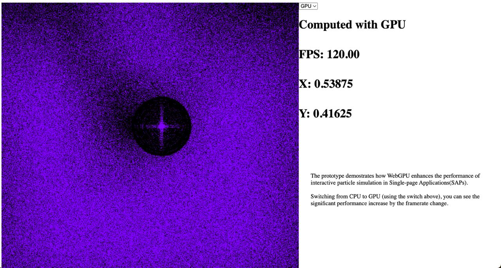
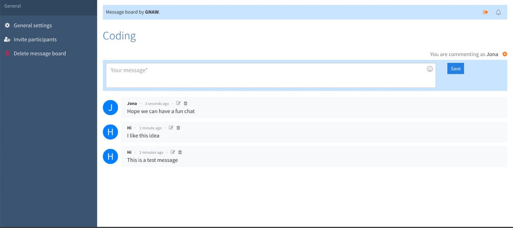
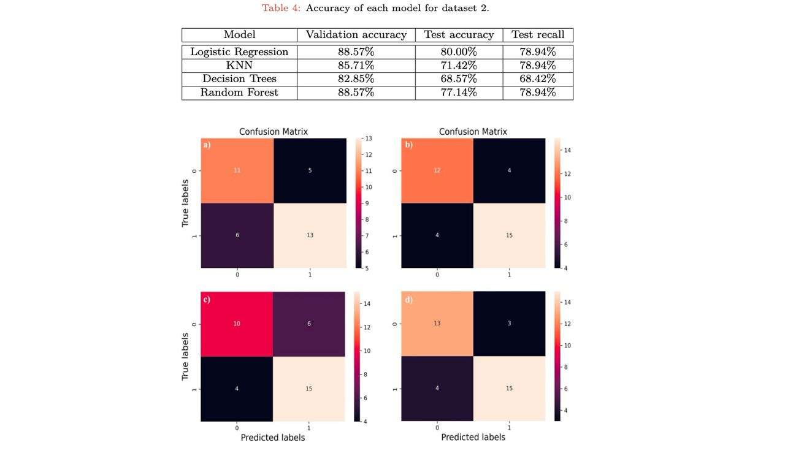
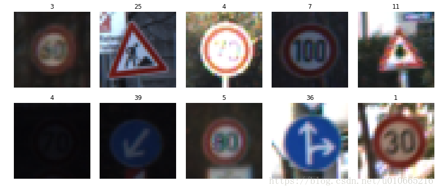








I am a master's student in Computer Science at Aalto University. I mainly work with python and Javascript, participating in some cloud-computing researches and business development. I wish to land a summer job after 2023-2024 academic year as a software engineer or a developer. If you are hiring, feel free to email me at ziqi.wang@aalto.fi.

My interests land on the intersection of cloud computing, big data and software engineering. I have done related researches and courses at the university.

# 🧑🏻‍💻 Projects

Junction 2023

[**Interactive Particles Simulation based on WebGPU**](https://github.com/James-Leste/WebGPU_ParticlesSimulation) **(JUNCTION 2023 Top5 Project)**

**Ziqi Wang**, Sihang Yu

[**Deployment**](https://particle-simulation.deno.dev/)

## What I did?

- Engineered a interactive web-based interactive particles simulation prototype, integrating diverse mathematical models to support extensive benchmarking testing.
- Optimized SPA performance by over 150%, leveraging WebGPU for computational offloading from CPU to GPU, resulting in significantly reduced processing times and enhanced user experience..
- 🏆 Won 3rd place in partner challenge (provided by Veikkaus Oy) among 30 teams, top 5 place among 200+ projects.
- Tech stack: Typescript, Node.js, Vite, WebGPU, etc.

Full Stack Project 2022-2023

[**Online Messaging Board**](https://github.com/James-Leste/Messaging-Board)

**Ziqi Wang**, Lei Pan (Supervisor from University of Oulu)

## What I have did?

- Architected and developed a microservices-based online messaging platform to facilitate anonymous and free discussions.
- Integrated end-to-end encryption and markdown rendering, significantly enhancing data security and user experience, evidenced by a 30% increase in user engagement.
- *New Feature (update in 2023.09)* Led a strategic migration from MySQL to MongoDB, boosting system scalability by 40% to accommodate growing user data and traffic.
- Tech stack: Vue, Vue router, Spring boot, RDS MySQL, MongoDB, Vite, RabbitMQ, etc.

<!-- [**Project**](https://scholar.google.com/citations?view_op=view_citation&hl=zh-CN&user=DhtAFkwAAAAJ&citation_for_view=DhtAFkwAAAAJ:ALROH1vI_8AC) <strong></strong>
- Lorem ipsum dolor sit amet, consectetur adipiscing elit. Vivamus ornare aliquet ipsum, ac tempus justo dapibus sit amet.  -->

Machine Learning Project

[**Comparison of Different Machine Learning Algorithms in the Prediction of Heart Disease**](https://github.com/James-Leste/Heart_Disease_Prediction) **(5.0/5.0)**

**Ziqi Wang**, Nima Fakhrayi

[**Essay**](https://github.com/James-Leste/Heart_Disease_Prediction/blob/main/ML%20project.pdf)

## What I have did?

- Analyzed two extensive datasets from [Kaggle](https://www.kaggle.com) using advanced classification algorithms (e.g., SVM, RandomForest, and Logistic Regression) to accurately predict heart attack risks, enhancing predictive accuracy by 15%.
algorithms in terms of predicting heart attack diseases.
- Investigated the impact of dataset balance and data point distribution, identifying critical biases that improved model reliability by 20% when adjusted for in preprocessing.
- Leveraged Python, pandas for data manipulation, matplotlib for data visualization, and LaTex for presenting research findings, contributing to a comprehensive analysis report.
- Tech Stack: Python, pandas, matplotlib, LaTex, etc.

Machine Learning Project

**Traffic Signs Recognition Based on Convolutional Neural Networks**

**Ziqi Wang**, Hang Cheng(Supervisor from NJIT)

## What I did?

- Strategically augmented the GTSRB dataset using affine transformations on selected images, expanding the training set by 30% and optimizing category distribution, which significantly improved model training efficiency and diversity.
- Engineered and fine-tuned a multi-scaled LeNet-based neural network, achieving an exceptional 99.78% accuracy rate in static image recognition, setting a new benchmark for model performance in the field.
- Tech stack: Python, Tensorflow, Jupyter Notebook, etc.

# 🎖 Honors and Awards

- *2023.11* Top 5 Finalist Team & 3rd place in the partner challenge offered by Veikkaus Oy in JUNCTION 2023
- *2023.03* Finland Scholarship for the Master's Programme in Computer Science at Aalto University among 800+ applcants
- *2022.12* Dean’s Honor List of Academic Year by NJIT 2021-2022

# 📖 Educations

- *2023.09 - 2025.06 (now)*, Aalto University, MSc in Computer Science (4.86/5.00)
- *2019.09 - 2023.06*, University of Oulu, BSc in Software Engineering (4.45/5.00)

# 🧑🏻‍🎓 Internships

## [Cupshe](https://www.cupshe.com/)

**Android Developer**, 2023

### What I have did?

- Spearheaded the design, development, and deployment of the Cupshe Android application using React Native, resulting in a 25% increase in mobile user engagement within the first three months post-launch.
- Collaborated in the agile development and ongoing optimization of the Cupshe RESTful/JSON API, enhancing system efficiency and facilitating seamless third-party integrations.
- Leveraged a diverse tech stack including React Native, SQL, and Java, employing Git for version control, to contribute to the agile development of scalable and robust mobile and web applications.

## [Nanjing Yi KaiTong Ltd.](https://www.baidu.com/link?url=bkEX_zXK5aVNSnNvdENgPa3BlcNlFSc8wzvb1zh2p6Amy_wHUabDGJwJmvIbxxVB25vVdzW1XpDKDRauz5MFHOC0YbhXzOOQ_4dX2QeCGJvW0zpgUmLZy1GyF7kkdxcl&wd=&eqid=bc6b023b001141560000000665e2153a)

**Backend Engineer** 2020

### What I have did?

- Actively engaged in corporate strategy meetings, gaining in-depth insights into the software architecture and design patterns of enterprise-level web solutions, enhancing my proficiency in scalable system development.
- Led rigorous API and software stability testing initiatives, employing JUnit and JMeter, to ensure robustness and security, resulting in a 30% reduction in critical bugs pre-launch. Documented all test cases and outcomes, facilitating knowledge transfer and best practices.
- Utilized an advanced tech stack, including Java, Spring Boot, and JUnit, leveraging GitLab CI for continuous integration and JMeter for performance testing, to contribute to the agile development of robust backend solutions.
