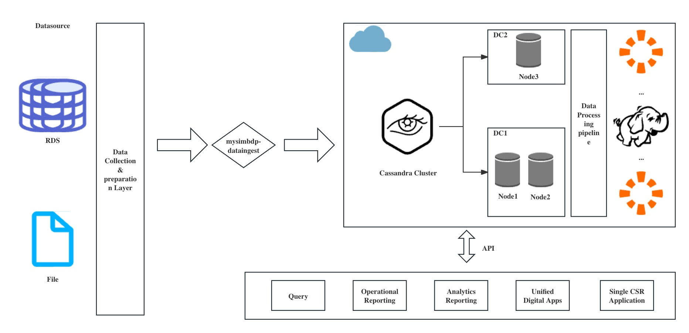








<!--  -->

# 🚶🏻 About Me

I am a 2nd master's student in Computer Science at Aalto University. I do full stack development, UI design, software architecture design and data anlysis.

My interests land on the intersection of cloud computing, software infrastructure and AI.

In my spare time, I actively contribute to open-source projects to keep myself updated with newly emerged technologies and build useful tools to elevate sustainability and improve efficiency. I am a quick learner and good at using online resources (official documentations, YouTube videos) to expand my expertise. My technical interests lie in developing embedded software/network architectures. Additionally, I enjoy running, hiking, playing basketball and playing video games to relax during holidays, and weekends.

# 🧑🏻‍🎓 Work Experience

## [Nokia](https://www.nokia.com/)
**Thesis worker**, will start from 2nd Jan. 2025

- TO BE DETERMINED

## [CS-IT, Aalto University](https://scicomp.aalto.fi/about/cs-it/)
**Web developer intern**, Oct. 2024 - Dec. 2024, 3 months

- Participating in the full-stack development and maintenance of the existing open-source software A+, which is extensively used by
students and teachers.
- Implementing extensive e2e tests with Playwright and unit tests with Pytest.
- Deployed containerized applications with k8s, ensuring consistent and scalable deployment across different environments.
- Tech Stack: Django, Kubernetes, PostgreSQL, Docker, Jenkin, NGINX, Selenium, Playwright.

## [Cupshe](https://www.cupshe.com/)

**Android developer**, 2023

### What I have did?

-   Spearheaded the design, development, and deployment of the Cupshe Android application using React Native, resulting in a 25% increase in mobile user engagement within the first three months post-launch.
-   Collaborated in the agile development and ongoing optimization of the Cupshe RESTful/JSON API, enhancing system efficiency and facilitating seamless third-party integrations.
-   Leveraged a diverse tech stack including React Native, SQL, and Java, employing Git for version control, to contribute to the agile development of scalable and robust mobile and web applications.

# 🧑🏻‍💻 Projects

GApe

[**GApe (Get A Page Easily)**](https://github.com/James-Leste/GApe)

**Ziqi Wang, Ali**

*Sep. 2024 - Present*

## What I did?

-   Implemented GApe, an interactive design tool for creating one-page content built around the concept of ‘dragging and customising’, meaning users are encouraged to apply the platform in an exploratory manner by placing every piece of widgets on a canvas freely. [Demo](https://gape-xi.vercel.app/)
-   Integrated and debugged the core functionality: Drag and Drop!
-   Tech used: Typescript, PostgreSQL, Next.Js, GitHub Action, Tailwind CSS

## Further Goals

-   Front page refactoring
-   Integrating client app

eyedentity

[**eyedentity**](https://github.com/James-Leste/eyedentity)

**Ziqi Wang, Ali, Sihang Yu**

*Nov. 2024 - Present*

## What I did?

- Created a human identifying tool based on deep gazing detection which can be easily integrated with online vote platforms and
provides a light-weight verification and progress tracking solution. [Demo](https://eyedentity-hazel.vercel.app/)
- [Won 2nd in the partner challenge provided by Sitra during Junction 2024.](https://www.linkedin.com/posts/sitra_junction2024-junctionhackathon-democracy-activity-7262385478174199809-z_GY)
- Tech used: React, JavaScript, Vite, Computer Vision.

## Further Goals

-   UI enhancement
-   Model-agnostic integration

qrsuite

[**qrsuite**](https://github.com/James-Leste/qrsuite)

**Ziqi Wang**

## What I did?

-   Implemented a smooth and interactive restaurant management system and its corresponding user-end application, which allow
    seamless interaction between restaurants and customers.
-   Tech used: Flutter, Dart, Firebase, Google Cloud Platform, Supabase, PostgreSQL, Stripe (Payment).

## Further Goals

-   Migrate from Firebase to open source Supabase.

Big Data Platform(Ongoing)

[**Big Data Analysis Platform**](https://github.com/James-Leste/Big-Data-Platform-2024)

**Ziqi Wang**, Hong-Linh Truong(supervisor)

## What I did?

-   Designed a comprehensive big data platform, integrating advanced components for data ingestion, real-time analysis, and secure storage, to support data-driven decision-making for multiple clients, handling over 1TB till now.
-   Developed a dynamic, multi-tenant user interface using Express.js, enabling intuitive interaction with complex big data workflows.
-   Tech Stack: Python, Cassandra, MQTT, Kafka, Google Cloud Platform, Express.js, etc.

## Further Goals

-   Simulate near real-time data ingestion.
-   Deal with encrypted data and security problems.

Junction 2023

[**Interactive Particles Simulation based on WebGPU**](https://github.com/James-Leste/WebGPU_ParticlesSimulation) **(JUNCTION 2023 Top5 Project)**

**Ziqi Wang**, Sihang Yu

[**Deployment**](https://particle-simulation.deno.dev/)

## What I did?

-   Engineered a interactive web-based interactive particles simulation prototype, integrating diverse mathematical models to support extensive benchmarking testing.
-   Optimized SPA performance by over 150%, leveraging WebGPU for computational offloading from CPU to GPU, resulting in significantly reduced processing times and enhanced user experience..
-   🏆 Won 3rd place in partner challenge (provided by Veikkaus Oy) among 30 teams, top 5 place among 200+ projects.
-   Tech stack: Typescript, Node.js, Vite, WebGPU, etc.

<!-- 

Full Stack Project 2022-2023

[**Online Messaging Board**](https://github.com/James-Leste/Messaging-Board)

**Ziqi Wang**, Lei Pan (Supervisor from University of Oulu)

## What I have did?

-   Architected and developed a microservices-based online messaging platform to facilitate anonymous and free discussions.
-   Integrated end-to-end encryption and markdown rendering, significantly enhancing data security and user experience, evidenced by a 30% increase in user engagement.
-   _New Feature (update in 2023.09)_ Led a strategic migration from MySQL to MongoDB, boosting system scalability by 40% to accommodate growing user data and traffic.
-   Tech stack: Vue, Vue router, Spring boot, RDS MySQL, MongoDB, Vite, RabbitMQ, etc. -->

<!-- [**Project**](https://scholar.google.com/citations?view_op=view_citation&hl=zh-CN&user=DhtAFkwAAAAJ&citation_for_view=DhtAFkwAAAAJ:ALROH1vI_8AC) <strong></strong>
- Lorem ipsum dolor sit amet, consectetur adipiscing elit. Vivamus ornare aliquet ipsum, ac tempus justo dapibus sit amet.  -->
<!-- 

 -->

Machine Learning Project

[**Comparison of Different Machine Learning Algorithms in the Prediction of Heart Disease**](https://github.com/James-Leste/Heart_Disease_Prediction) **(5.0/5.0)**

**Ziqi Wang**, Nima Fakhrayi

[**Essay**](https://github.com/James-Leste/Heart_Disease_Prediction/blob/main/ML%20project.pdf)

## What I have did?

-   Analyzed two extensive datasets from [Kaggle](https://www.kaggle.com) using advanced classification algorithms (e.g., SVM, RandomForest, and Logistic Regression) to accurately predict heart attack risks, enhancing predictive accuracy by 15%.
    algorithms in terms of predicting heart attack diseases.
-   Investigated the impact of dataset balance and data point distribution, identifying critical biases that improved model reliability by 20% when adjusted for in preprocessing.
-   Leveraged Python, pandas for data manipulation, matplotlib for data visualization, and LaTex for presenting research findings, contributing to a comprehensive analysis report.
-   Tech Stack: Python, pandas, matplotlib, LaTex, etc.

Machine Learning Project

**Traffic Signs Recognition Based on Convolutional Neural Networks**

**Ziqi Wang**, Hang Cheng(Supervisor from NJIT)

## What I did?

-   Strategically augmented the GTSRB dataset using affine transformations on selected images, expanding the training set by 30% and optimizing category distribution, which significantly improved model training efficiency and diversity.
-   Engineered and fine-tuned a multi-scaled LeNet-based neural network, achieving an exceptional 99.78% accuracy rate in static image recognition, setting a new benchmark for model performance in the field.
-   Tech stack: Python, Tensorflow, Jupyter Notebook, etc.

# 📖 Educations

-   _2023.09 - 2025.06 (now)_, Aalto University, MSc in Computer Science (4.91/5.00)
-   _2019.09 - 2023.06_, University of Oulu, BSc in Software Engineering (4.45/5.00)

# 🎖 Honors and Awards

-   _2023.11_ Top 5 Finalist Team & 3rd place in the partner challenge offered by Veikkaus Oy in JUNCTION 2023
-   _2023.03_ Finland Scholarship for the Master's Programme in Computer Science at Aalto University among 800+ applcants
-   _2022.12_ Dean’s Honor List of Academic Year by NJIT 2021-2022

